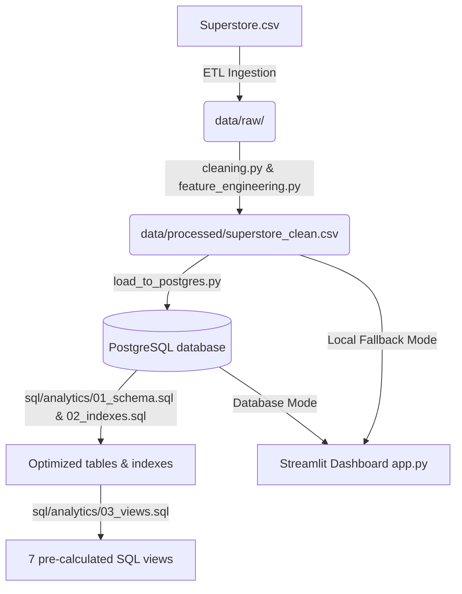

# Retail Sales Analytics Platform

[](#etl-pipeline-workflow)
[](#sql-analytical-layer)
[](#streamlit-dashboard)
[](#testing-and-verification)
[](LICENSE)

An enterprise-ready, end-to-end Retail Analytics and Business Intelligence (BI) platform designed around the US Superstore sales dataset. This solution implements a robust data processing pipeline (cleaning, type casting, duplicate removal), constructs advanced business features, loads data into an optimized PostgreSQL relational schema, and provides a native Python interactive **Streamlit Dashboard** to drive deep business insight.

---

## 📌 Business Problem

In competitive retail spaces, managers need to understand sales performance, profitability trends, customer behaviors, and shipping efficiencies across product categories and regions. 

This platform solves these problems by:
1. **Consolidating Transaction Records**: Processing raw transactional sales records into a structured data warehouse.
2. **Exposing Profitability Metrics**: Identifying loss-making products, high-discount bands, and low-margin customer segments.
3. **Optimizing Transit Times**: Tracking shipping delays by shipping mode to locate distribution bottlenecks.
4. **Providing an Interactive UI**: Displaying dynamic KPIs, monthly trends with moving averages, segment performance, and shipping logistics in an easy-to-use web interface.

---

## 🛠️ Tech Stack

* **Data Engineering & ETL**: Python 3, Pandas, NumPy, python-dotenv
* **Database Layer**: PostgreSQL, `psycopg2-binary` for batch loads
* **SQL Analytics**: PostgreSQL Views, CTEs, Window Functions, Indexes
* **BI & Visualization**: Streamlit (Python web dashboard framework)
* **Testing**: pytest

---

## 📐 System Architecture

The platform follows a decoupled three-tier analytics architecture:



---

## 📁 Repository Directory Structure

```
Retail-Sales-Analytics-Platform/
├── data/
│   ├── raw/                           # Raw transactional CSV (Superstore)
│   └── processed/                     # Cleaned & feature-engineered CSV
├── notebooks/
│   └── (exploratory analyses and Jupyter notes)
├── src/
│   └── retail_analytics/
│       ├── __init__.py
│       ├── cleaning.py                # Type casting, duplicate removal, naming cleanup
│       ├── feature_engineering.py     # Custom business bins, profit indicators, & rates
│       ├── pipeline.py                # Main ETL coordinator
│       └── postgres_loader.py         # DataFrame schema alignment & DDL helpers
├── sql/
│   └── analytics/
│       ├── 01_schema.sql              # Physical table DDL
│       ├── 02_indexes.sql             # SQL index optimization
│       ├── 03_views.sql               # 7 pre-calculated analytical views
│       └── 04_business_queries.sql    # Specific SQL answers to business questions
├── scripts/
│   └── load_to_postgres.py            # Executable script running ETL and PG migration
├── tests/
│   ├── test_cleaning.py               # Unit tests for loading and clean checks
│   └── test_postgres_loader.py        # Unit tests for postgres alignment
├── app.py                             # Interactive Streamlit application
├── requirements.txt                   # Project dependencies
├── pytest.ini                         # Pytest configuration
├── README.md                          # Main repository page (highly detailed)
└── .gitignore                         # Git exclusion rules
```

---

## 🔄 ETL & Feature Engineering

### 1. Data Cleaning (`cleaning.py`)
- **Duplicates**: Deduplicates rows based on all fields except `row_id` to maintain transaction integrity.
- **Type Coercion**: Standardizes numerical variables (`sales`, `quantity`, `discount`, `profit`, `postal_code`) and date columns (`order_date`, `ship_date`).
- **Formatting**: Normalizes column names to standard `lower_snake_case`.
- **Validation**: Identifies invalid metrics (negative sales/quantities, discounts outside of [0, 1]) and aggregates anomalies in a data quality report.

### 2. Custom Business Features (`feature_engineering.py`)
To enrich downstream dashboards, the pipeline constructs several indicators:
* **`shipping_days`**: The exact transit time (`ship_date` - `order_date`) clipped to non-negative values.
* **`profit_margin`**: Profit divided by sales, representing transaction profitability.
* **`revenue_per_unit`**: Unit rate of transaction (`sales` / `quantity`).
* **`discount_percentage`**: Standardized discount rate (`discount` * 100).
* **`discount_band`**: Binned discount category (`low` for <= 10%, `medium` for <= 20%, `high` for <= 30%, `very_high` for > 30%).
* **`profitability_flag`**: Boolean flag indicating whether the transaction generated profit (`profit` > 0).
* **Date Grouping Variables**: Extracting `order_year`, `order_month`, `order_month_name`, `order_quarter`, and a `weekend_flag`.

---

## 🗄️ SQL Analytical Layer

Our SQL Layer features optimized structures, indexes, and reusable views:
* **`01_schema.sql`**: Table schema for the analytical table `retail_orders`.
* **`02_indexes.sql`**: Indexes created on date, region, categories, segments, shipping modes, and year-months to speed up analytical filtering.
* **`03_views.sql`**: Exposes 7 pre-calculated views for analytical queries:
  - `vw_sales_summary`: Flat layout with running window totals.
  - `vw_monthly_sales`: Aggregated monthly sales, running totals, and moving averages.
  - `vw_region_performance`: Sales/profits metrics and rankings grouped by region.
  - `vw_category_performance`: Sales/profits metrics and rankings grouped by product category.
  - `vw_customer_summary`: Aggregated customer transaction details and ranking based on sales.
  - `vw_product_performance`: Sales and margins grouped by product name.
  - `vw_shipping_analysis`: Groups shipping performance and averages transit days.

### Example business queries solved in `04_business_queries.sql`
- Monthly sales trends with running totals.
- Sales by region and product category.
- Customer segmentations and top-paying customer rankings.
- Shipping performance analysis binned by efficiency.
- Profit margins and revenue impact across discount bands.

---

## 📊 Streamlit Dashboard

The web application [app.py](file:///c:/Users/souna/.antigravity/Retail-Sales-Analytics-Platform/app.py) provides a modern dashboard interface featuring **4 tabs**:
1. **Sales & Profit Trends**: Visual line charts tracking monthly sales, bar charts showing regional revenues vs. profits, and a state-level performance grid.
2. **Customer Analytics**: Breaks down sales share and profit margins by customer segment, showing a top 10 customers performance table.
3. **Product Insights**: Sales per sub-category bar charts, discount band profit impact analysis, and top 15 most profitable products.
4. **Logistics & Shipping**: Evaluates transit days by shipping mode and shipping count distributions.

### How to Run the Dashboard
Ensure all package requirements are installed:
```bash
pip install -r requirements.txt
```
To run the dashboard server locally:
```bash
streamlit run app.py
```
This will automatically launch the app in your default browser at `http://localhost:8501`.

---

## 🧪 Testing and Verification

Automated unit tests check data transformations and PostgreSQL schema alignments.
* **`test_cleaning.py`**: Asserts duplicate handling, header renaming, date parsing, and type castings.
* **`test_postgres_loader.py`**: Verifies dataframe reordering, boolean conversions, and numeric formatting.

To execute the test suite:
```bash
python -m pytest
```
